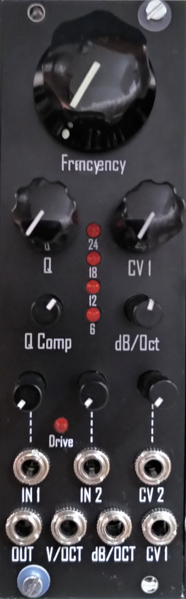

# Transistor Ladder VCF

- VCF based on the Moog Transistor Ladder Filter
- Compensation for loss of bass in high resonace settings via potentiometer
- 6,12,18,24 dB/Oct selectable via potentiometer or CV!
- 2 Inputs with attenuator for audio and CV
- Seperat V/Oct input.
- Input-Drive indicator LED
- 8HP

- All files are published under CC BY-NC-SA 4.0 if not marked differently
- DO NOT USE COMMERCIALLY!
- Build for yourself or for a friend, but do not sell builds, PCBs, pannels or any parts of the designes in this repository! 
- Feel free to modify, copy and use all files provided here. If you want to publish derivative work, please do so under same license as original

- Any feedback and collaboration is very welcome!
- Please feel free to [open an issue on the issues tab](https://github.com/Cs4System/Eurorack/issues)

## Order
- Preorder: If you are interested in a set of PCB+panel or a finished build please let me know via Email: lorenz-neumann[at]gmx.de

