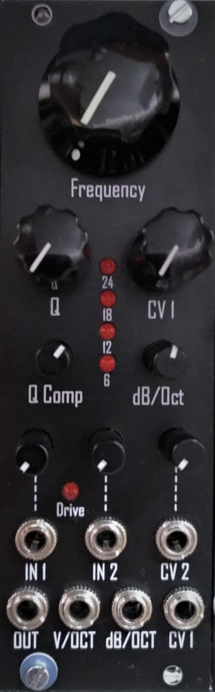

# Transistor Ladder VCF

- VCF based on the Moog Transistor Ladder Filter
- Compensation for loss of bass in high resonace settings via potentiometer
- 6,12,18,24 dB/Oct selectable via potentiometer or CV!
- 2 Inputs with attenuator for audio and CV
- Seperat V/Oct input.
- Input-Drive indicator LED
- 8HP
- small and dense SMD build (0603, SOIC, SOT-363!) Not a beginner build, please be sure to have some SMD-soldering practice!
- 45mA @ +12V and 25mA @ -12V
- quick demo:  https://youtu.be/XMdGtwIK5IQ

- All files are published under CC BY-NC-SA 4.0 
- DO NOT USE COMMERCIALLY!
- Build for yourself or for a friend, but do not sell builds, PCBs, pannels or any parts of the designes in this repository! 
- Feel free to modify, copy and use all files provided here. If you want to publish derivative work, please do so under same license as original

- Any feedback and collaboration is very welcome!
- Please feel free to [open an issue on the issues tab](https://github.com/Cs4System/Eurorack/issues)

## How to get involved:
For ongoing discussion see:
https://www.muffwiggler.com/forum/viewtopic.php?f=17&t=244412&p=3457366#p3457366

## Order
- Preorder: If you are interested in a set of PCB+panel or a finished build please let me know via Muffwiggler
- Please note, the hole project is still in beta testing!
- PCB and Panel will be available at [Pusherman](https://pushermanproductions.com/) soon.

